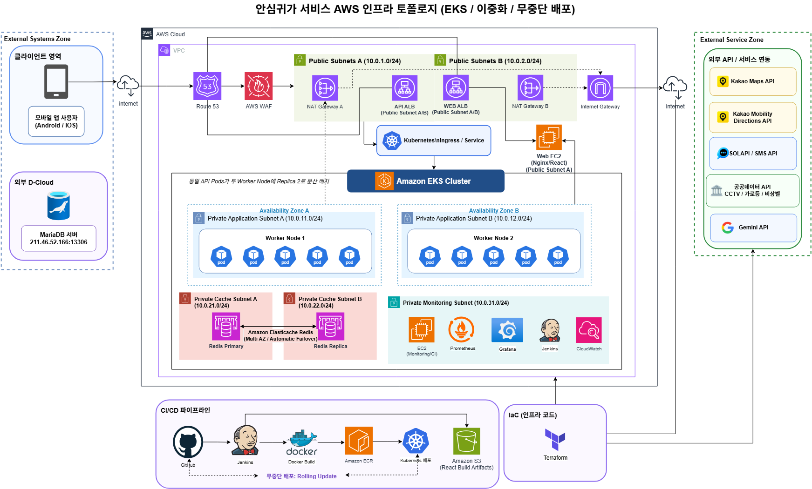

# RIMO

> **안전데이터 기반 안심귀가 및 보호자 연동 서비스**  
> **“가장 빠른 길이 아닌, 더 안심할 수 있는 길”**

RIMO는 CCTV, 보안등, 비상벨 등 **공공 안전데이터**를 활용하여  
사용자에게 안전한 귀가 경로를 제공하고, 실시간 위치 공유와 이상 상황 감지,  
보호자 긴급 알림까지 하나의 귀가 과정으로 연결한 모바일 서비스입니다.

---

## 🔗 Service

### RIMO Web
https://www.rimo-app.com/

서비스 소개, 주요 기능 및 앱 정보를 확인할 수 있습니다.

---

## 📌 Project Overview

야간 보행 시 사용자가 느끼는 불안과 기존 안심귀가 서비스의 한계를 개선하기 위해  
**안전시설 데이터 기반의 경로 추천과 실시간 보호 기능을 결합한 서비스**를 개발했습니다.

RIMO는 단순히 최단 경로만 제공하지 않고,

- 빠른길
- AI 안전경로
- 대로변 경로

를 비교하여 사용자가 상황에 맞는 귀가 경로를 선택할 수 있도록 구성했습니다.

또한 귀가 중 실시간 위치 공유, 이상 상황 자동 감지, 긴급 신고 및 보호자 알림 기능을 통해  
**귀가 전 · 중 · 후 전 과정을 지원하는 서비스**를 목표로 했습니다.

---

# ✨ Key Features

## 1. AI Safe Route · 안심경로

목적지를 검색하면 여러 경로를 비교하고  
안전시설 데이터를 기반으로 AI 안전경로를 제공합니다.

- 빠른길 / AI 안전경로 / 대로변 비교
- AI 추천 이유 제공
- 선택 경로 기반 귀가 안내
- 이동 중 연속 경로 안내

---

## 2. Live Location · 안심친구

안심친구와 필요한 순간 위치를 공유하고  
친구의 현재 위치를 지도에서 확인할 수 있습니다.

- 위치 공유 ON / OFF
- 안심친구 현재 위치 확인
- 이상 상황 알림 연동

---

## 3. Safety Map · 안심지도

현재 위치 주변의 안전시설 정보를 지도에서 확인할 수 있습니다.

- CCTV
- 보안등
- 비상벨
- 기타 공공 안전시설

사용자가 필요한 시설 유형을 선택하여  
주변 안전 인프라를 확인할 수 있도록 구성했습니다.

---

## 4. Emergency · 긴급신고

긴급 상황 발생 시 등록된 보호자에게  
사용자의 현재 위치와 위치 확인 URL을 전달합니다.

- 보호자 SMS 알림
- 현재 위치 전달
- 실시간 위치 확인 URL 제공
- 앱 설치 없이 웹에서 위치 확인

---

## 5. Safety Alarm · 꽥꽥이

위험한 순간 경고음과 플래시를 즉시 실행하여  
주변에 위험 상황을 알릴 수 있는 보조 기능입니다.

- 경고음
- 플래시
- 즉시 실행 / 중지

---

## 6. My Report · 사용 리포트

귀가 기록과 서비스 이용 정보를 대시보드 형태로 확인할 수 있습니다.

- 귀가 요약 대시보드
- 날짜별 귀가 기록
- 이동 상세 정보 확인
- 귀가 이력 관리

---

# 🚨 Automatic Safety Detection

귀가 중 사용자의 이동 상태를 분석하여  
이상 상황을 자동으로 감지합니다.

### 감지 상황

- 일정 시간 이상 움직임이 없는 경우
- 선택한 귀가 경로를 이탈한 경우

### 대응 Flow

```text
이상 상황 감지
      ↓
사용자 확인 알림
      ↓
응답 없음
      ↓
보호자에게 긴급 알림
      ↓
실시간 위치 URL 전달
```

---

# 🏗 System Architecture



RIMO는 AWS와 Kubernetes를 기반으로  
확장성과 운영 안정성을 고려한 Cloud Native 환경으로 구성했습니다.

```text
Android Client
      ↓
Amazon Route 53
      ↓
AWS WAF
      ↓
Application Load Balancer
      ↓
Kubernetes Ingress / Service
      ↓
Amazon EKS
      ↓
Microservices
      ↓
Redis / MariaDB
```

외부 API 및 공공데이터와 연동하여  
지도, 경로 탐색, AI 추천, SMS, 안전시설 정보를 제공합니다.

---

# ⚙️ Microservices

Backend는 기능별로 5개의 서비스로 분리했습니다.

| Service | Description |
|---|---|
| `auth-api` | 인증 / 회원가입 |
| `member-api` | 회원 프로필 / 안심친구 |
| `tracking-api` | 실시간 위치 / 이상 상황 감지 |
| `route-api` | 안전경로 / AI 추천 |
| `data-api` | 공공데이터 / 사용 리포트 |

기능별 서비스를 독립적으로 구성하여  
특정 서비스의 장애가 전체 시스템으로 확산되는 것을 줄이고  
서비스별 배포와 확장이 가능하도록 구성했습니다.

---

# ☁️ Cloud Infrastructure

## AWS

- Amazon VPC
- Amazon EC2
- Amazon EKS
- Amazon ECR
- Amazon S3
- Amazon ElastiCache Redis
- Application Load Balancer
- Route 53
- AWS WAF
- CloudWatch
- IAM
- NAT Gateway

### Multi-AZ

EKS Worker Node와 API Pod를 서로 다른 Availability Zone에 분산하여  
단일 Node 장애 시에도 서비스가 유지될 수 있도록 구성했습니다.

```text
Availability Zone A
 └─ Worker Node 1
     └─ API Pods

Availability Zone B
 └─ Worker Node 2
     └─ API Pods
```

---

# 📈 Auto Scaling

Kubernetes HPA를 적용하여  
서비스 부하에 따라 Pod 수가 자동으로 조절되도록 구성했습니다.

### 구성

- Metrics Server
- Horizontal Pod Autoscaler
- CPU 기반 Scaling
- Replica 자동 확장

부하 테스트 과정에서 Pod가 실제로

```text
2 Pods → 8 Pods
```

까지 자동 확장되는 것을 확인했습니다.

---

# 🚀 CI/CD

GitHub `main` 브랜치의 변경 사항을 Jenkins가 감지하여  
Backend 서비스를 Amazon EKS에 자동 배포하도록 구성했습니다.

```text
GitHub
   ↓
Jenkins
   ↓
Docker Build
   ↓
Amazon ECR
   ↓
Amazon EKS
   ↓
Rolling Update
```

### Pipeline

1. GitHub Main Branch 변경
2. Jenkins Pipeline 실행
3. 5개 Backend Service Docker Build
4. Amazon ECR Push
5. Kubernetes Image Update
6. Rolling Update
7. Deployment 상태 확인

---

# 🧱 Infrastructure as Code

Terraform을 이용하여 주요 AWS 인프라를 코드로 관리했습니다.

### 관리 대상

- VPC
- Subnet
- Internet Gateway
- NAT Gateway
- Route Table
- EKS
- ALB
- Monitoring EC2
- IAM
- Security Group
- ElastiCache

```bash
terraform init
terraform plan
terraform apply
```

인프라 변경 사항을 코드와 Git 이력으로 관리하여  
환경 차이와 수동 설정 누락을 줄일 수 있도록 구성했습니다.

---

# 📊 Monitoring & Observability

Prometheus와 Grafana를 이용하여  
서비스 운영 상태를 실시간으로 확인할 수 있는 모니터링 환경을 구축했습니다.

## Backend Monitoring

- CPU
- Memory
- Pod 수
- 응답 시간
- 외부 API 호출

## Redis Monitoring

- Cache Hit Rate
- Memory Usage
- Connected Clients
- Command Throughput
- Key 상태

## AWS Infrastructure Monitoring

CloudWatch와 연동하여

- ALB
- NAT Gateway
- WAF
- EKS Node

상태를 확인할 수 있도록 구성했습니다.

## Developer Monitoring

- Jenkins Build 상태
- Error Log
- 서비스 로그
- Loki / Promtail

---

# 🔔 Alerting

Grafana Alerting과 Slack을 연동하여  
서비스 이상 상황을 실시간으로 확인할 수 있도록 구성했습니다.

예를 들어 `route-api`의 CPU 사용률이 임계값을 초과하면

```text
CPU 임계값 초과
      ↓
Grafana Alert 발생
      ↓
Dashboard 상태 변경
      ↓
Slack #rimo-alerts 알림
```

순서로 운영자가 즉시 상황을 확인할 수 있습니다.

---

# 🧪 Load Test

nGrinder를 이용하여 실제 서비스 API에 부하를 발생시키고  
시스템의 확장 동작과 병목 구간을 확인했습니다.

---

## Kakao API Bottleneck

### 문제

동일한 경로 요청이 반복되면서  
외부 Kakao API 호출량이 증가하여 요청 실패가 발생했습니다.

### 해결

Redis Cache를 적용하여  
같은 경로 요청은 기존 결과를 재사용하도록 개선했습니다.

### Result

```text
Error Rate
69% → 0%

TPS
9.5 → 31.4
```

처리량은 약 **3.3배 증가**했습니다.

---

## Gemini API Bottleneck

### 문제

Pod를 확장해도 응답 지연이 크게 개선되지 않았습니다.

분석 결과 Pod 처리 능력보다는  
외부 Gemini API의 응답 대기 시간이 주요 병목이었습니다.

### 해결

동일한 조건의 AI 추천 결과를 Redis에 캐싱하여  
불필요한 외부 API 호출을 줄였습니다.

### Result

```text
TPS
30.0 → 34.0
```

이를 통해 단순한 Pod 확장뿐만 아니라  
외부 API 호출 구조와 캐싱 전략을 함께 고려해야 한다는 점을 확인했습니다.

---

# 🛠 Tech Stack

## Mobile

- Android
- Kotlin
- Jetpack Compose
- Retrofit
- Coroutines
- GPS / Location API

## Backend

- Java 17
- Spring Boot
- Spring Security
- JWT
- REST API
- Redis
- MariaDB

## Web

- React
- Vite
- Nginx

## Cloud

- AWS
- Amazon VPC
- Amazon EC2
- Amazon EKS
- Amazon ECR
- Amazon S3
- Amazon ElastiCache
- Application Load Balancer
- Route 53
- AWS WAF
- CloudWatch

## DevOps

- Docker
- Kubernetes
- Jenkins
- Terraform
- GitHub
- HPA
- Metrics Server

## Monitoring

- Prometheus
- Grafana
- Loki
- Promtail
- CloudWatch
- Slack Alerting
- nGrinder

## External API

- Kakao Maps API
- Kakao Mobility Directions API
- 공공데이터 API
- SOLAPI
- Gemini API

---

# 🎬 Demo

RIMO의 실제 기능 및 시스템 동작을 확인할 수 있는 시연 자료입니다.

👉 [**시연 자료 확인하기**](./07_demo)

---

# 📂 Project Documents

프로젝트 과정에서 작성한 상세 산출물입니다.

| Category | Description | Link |
|---|---|---|
| Overview | 프로젝트 개요 및 서비스 소개 | [바로가기](./01_overview) |
| UI / UX Design | 화면 설계 및 Prototype | [바로가기](./02_design) |
| API | Backend API 명세 | [바로가기](./03_API) |
| Database | ERD 및 데이터 명세 | [바로가기](./04_database) |
| Public Data | 공공 안전시설 데이터 | [바로가기](./05_public-data) |
| Infrastructure | AWS / EKS 인프라 구성 | [바로가기](./06_infrastructure) |
| Demo | 서비스 및 부하 테스트 시연 | [바로가기](./07_demo) |
| Presentation | 프로젝트 최종 발표자료 | [바로가기](./08_presentation) |

---

# 📁 Repository Structure

```text
rimo-project/
│
├─ README.md
│
├─ 01_overview/
│  ├─ 프로젝트 요약
│  └─ 서비스 개요
│
├─ 02_design/
│  └─ 화면 설계 및 Prototype
│
├─ 03_API/
│  └─ API 명세서
│
├─ 04_database/
│  ├─ ERD
│  └─ 데이터 명세서
│
├─ 05_public-data/
│  └─ 공공 안전시설 데이터
│
├─ 06_infrastructure/
│  └─ AWS Infrastructure Topology
│
├─ 07_demo/
│  └─ RIMO 시연 영상
│
└─ 08_presentation/
   └─ RIMO 최종 발표자료
```

---

# 👥 Team

**SAFE:ON**

- 맹시윤
- 이수경
- 이동기
- 임수현

---

## RIMO

> **안전시설 데이터, 실시간 위치 공유 및 이상 상황 대응,  
> Cloud Native 인프라를 하나의 귀가 과정으로 연결한 안전 귀가 지원 서비스**
