# RIMO

> ### 안전데이터 기반 안심귀가 및 보호자 연동 서비스
> **“가장 빠른 길이 아닌, 더 안심할 수 있는 길”**

RIMO는 CCTV, 보안등, 비상벨 등 **공공 안전데이터**를 활용하여  
사용자에게 안전한 귀가 경로를 제공하고, 실시간 위치 공유 · 이상 상황 감지 · 보호자 긴급 알림까지  
하나의 귀가 과정으로 연결한 **클라우드 기반 안심귀가 모바일 서비스**입니다.

<br>

---

# 👥 Team & Roles

**Team SAFE:ON**

| 이름 | 담당 역할 |
|---|---|
| **맹시윤 · 팀장** | 모바일 UI/UX 개발 · 안심경로/대시보드 개발 · Terraform/EKS 인프라 구축 · HPA 트래픽 대응 구성 · RIMO 웹페이지 개발/배포 |
| **이동기** | 테스트 환경·네트워크 구축 · API 통합 및 보안 적용 · 실시간 위치공유 개발 · 회원가입/로그인 개발 |
| **이수경** | 모니터링 구축 · Prometheus/Grafana 구축 · 부하 테스트 · 긴급신고/안전 알림 개발 |
| **임수현** | Jenkins CI/CD 구축 · 공공데이터 수집 · 친구 관리 기능 개발 · 지도/알림 기능 개발 |

<br>

---

# 📌 Project Overview

야간 시간대 혼자 이동하는 사용자가 느끼는 불안과  
기존 안심귀가 서비스의 단순 위치 공유 중심 한계를 보완하기 위해 개발한 프로젝트입니다.

RIMO는 단순히 최단 경로만 안내하는 것이 아니라  
**주변 안전시설 데이터를 함께 고려하여 사용자가 직접 귀가 경로를 비교하고 선택할 수 있도록 구성**했습니다.

사용자는 목적지를 설정한 뒤

- **빠른길**
- **AI 안전경로**
- **대로변 경로**

를 비교하여 원하는 경로를 선택할 수 있습니다.

귀가 중에는 안심친구와 현재 위치를 공유하고,  
경로 이탈이나 장시간 비활동과 같은 이상 상황을 감지합니다.

긴급 상황에서는 보호자에게 SMS와 실시간 위치 확인 URL을 전송하여  
앱을 설치하지 않은 보호자도 사용자의 위치를 확인할 수 있습니다.

### 🎯 핵심 목표

- 안전시설 데이터를 활용한 안전경로 제공
- 안심친구와 실시간 위치 공유
- 경로 이탈 · 비활동 등 이상 상황 감지
- 보호자 긴급 알림 및 실시간 위치 확인
- AWS / EKS 기반 안정적인 서비스 환경 구축
- CI/CD 자동화를 통한 반복 가능한 배포 환경 구성
- 모니터링 및 부하 테스트를 통한 운영 상태 검증

<br>

---

# 🔗 Service

### RIMO Web

👉 **https://www.rimo-app.com/**

서비스 소개와 주요 기능을 웹사이트에서 확인할 수 있습니다.

<br>

---

# ✨ Key Features

## 01. AI Safe Route · 안심경로

목적지를 검색하면 **빠른길 · AI 안전경로 · 대로변 경로**를 비교하여 제공합니다.

안전시설 데이터를 활용한 경로뿐만 아니라  
AI가 해당 경로를 추천한 이유도 함께 확인할 수 있습니다.

- 목적지 검색 및 경로 비교
- AI 안전경로 추천
- AI 추천 이유 제공
- 선택 경로 기반 귀가 안내
- 귀가 진행 상태 확인
- 경로 이탈 감지
- 비활동 감지
- 긴급신고 연동

<p align="center">
  
  
  
</p>

<p align="center">
  <sub>안심경로 메인 · 경로 선택 · AI 추천 이유</sub>
</p>

<p align="center">
  
  
  
</p>

<p align="center">
  <sub>귀가 진행 · 경로 이탈 감지 · 비활동 감지</sub>
</p>

<br>

---

## 02. Live Location · 안심친구

친구를 안심친구로 등록하고  
필요한 순간 자신의 위치를 공유하거나 친구의 현재 위치를 지도에서 확인할 수 있습니다.

- 친구 검색 및 추가
- 친구 요청 수락
- 위치 공유 ON / OFF
- 친구 실시간 위치 확인
- 이상 상황 알림 연동

<p align="center">
  
  
  
</p>

<p align="center">
  <sub>안심친구 · 위치 공유 ON · 친구 위치 확인</sub>
</p>

<details>
<summary><b>친구 추가 과정 보기</b></summary>

<br>

<p align="center">
  
  
  
</p>

</details>

<br>

---

## 03. Safety Map · 안심지도

현재 위치 주변의 공공 안전시설을 지도에서 확인할 수 있습니다.

- CCTV 위치
- 보안등 위치
- 주변 안전시설 탐색
- 현재 위치 중심 조회

<p align="center">
  
  
</p>

<p align="center">
  <sub>CCTV 위치 조회 · 보안등 위치 조회</sub>
</p>

<br>

---

## 04. Emergency · 긴급신고

위험 상황에서 긴급신고를 실행하면  
등록된 보호자에게 사용자의 현재 위치와 위치 확인 URL을 SMS로 전송합니다.

보호자는 별도의 RIMO 앱을 설치하지 않아도  
전달받은 URL을 통해 사용자의 위치를 확인할 수 있습니다.

- 즉시 긴급신고
- 보호자 SMS 전송
- 현재 위치 전달
- 실시간 위치 확인 URL
- 보호자의 사용자 위치 확인
- 안심친구 긴급상황 알림

<p align="center">
  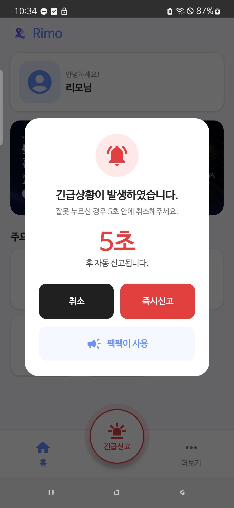
  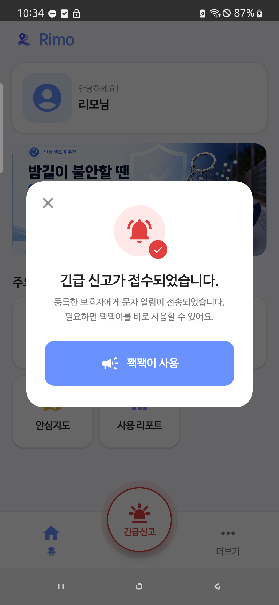
  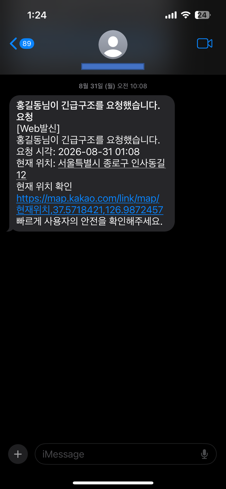
</p>

<p align="center">
  <sub>긴급신고 실행 · 즉시 신고 · 보호자 SMS</sub>
</p>

<p align="center">
  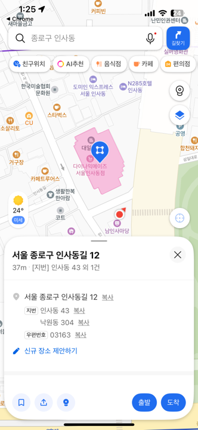
  
</p>

<p align="center">
  <sub>보호자 위치 확인 · 안심친구 긴급 알림</sub>
</p>

<br>

---

## 05. Safety Alarm · 꽥꽥이

긴급한 순간 경고음과 플래시를 즉시 작동시켜  
주변에 위험 상황을 알릴 수 있는 보조 안전 기능입니다.

- 경고음
- 플래시
- 즉시 실행 / 중지

<p align="center">
  
</p>

<br>

---

## 06. My Report · 사용 리포트

귀가가 완료되면 이동 기록을 저장하고  
대시보드와 기록 화면을 통해 이전 귀가 정보를 확인할 수 있습니다.

- 귀가 요약 대시보드
- 날짜별 귀가 기록
- 귀가 상세 정보
- 이동 경로 확인
- 선택 경로 확인

<p align="center">
  
  
  
</p>

<p align="center">
  <sub>귀가 대시보드 · 날짜별 기록 · 선택 경로 확인</sub>
</p>

<br>

---

# 🚨 Automatic Safety Detection

RIMO는 사용자가 직접 긴급신고 버튼을 누르는 상황뿐 아니라  
귀가 중 발생할 수 있는 이상 행동을 감지하여 대응합니다.

### 비활동 감지

귀가 중 일정 시간 이상 움직임이 없을 경우 사용자에게 확인 알림을 제공합니다.

### 경로 이탈 감지

사용자가 선택한 안심경로를 벗어날 경우 경로 이탈 상황을 감지합니다.

### 대응 Flow

```text
이상 상황 감지
      ↓
사용자 확인 알림
      ↓
응답 여부 확인
      ↓
응답 없음
      ↓
보호자 / 안심친구 알림
```

<p align="center">
  
  
  
</p>

<br>

---

# 📱 Additional Screens

핵심 서비스 외에도 회원가입, 보호자 등록, 프로필 및 기본 목적지 설정 기능을 제공합니다.

<details>
<summary><b>Login / Sign Up 화면 보기</b></summary>

<br>

<p align="center">
  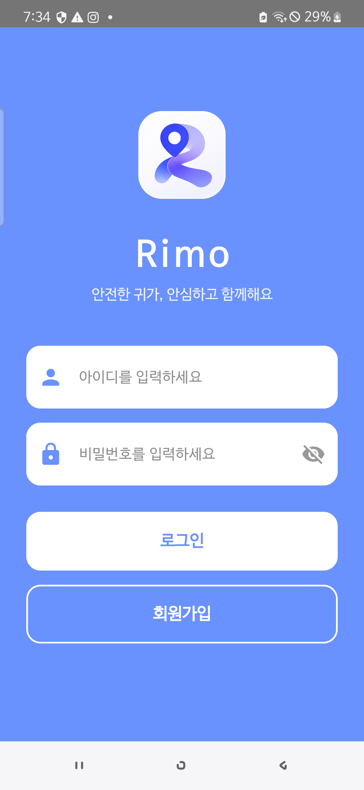
  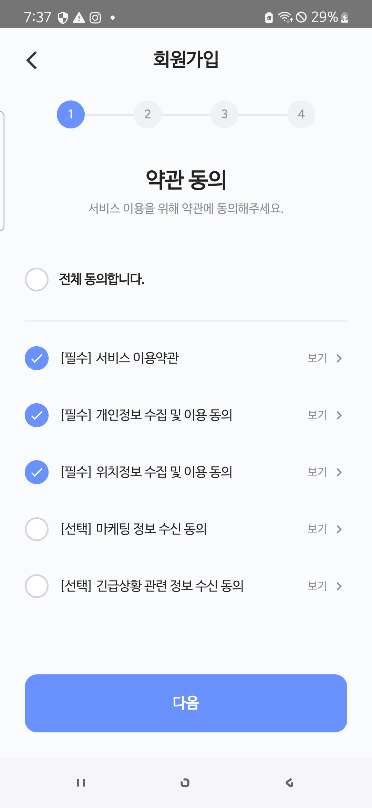
  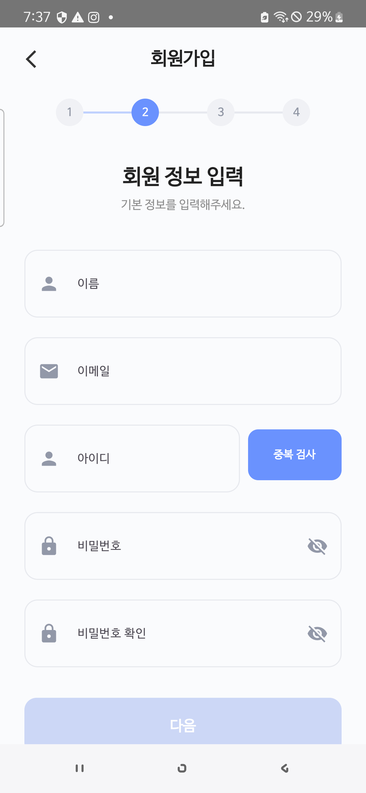
  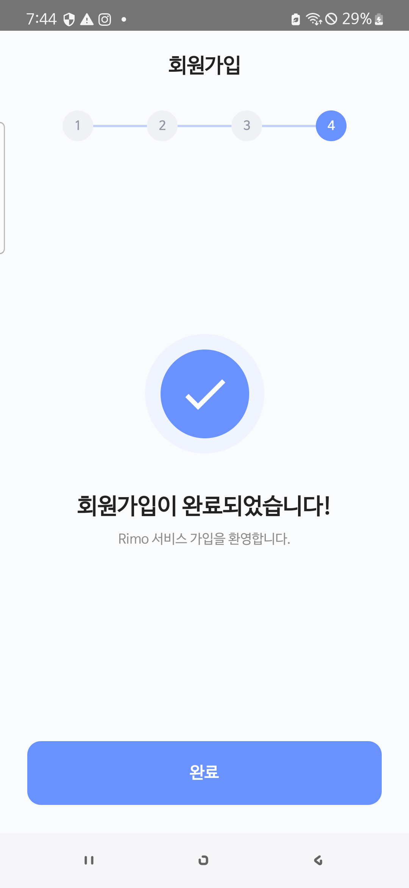
</p>

</details>

<details>
<summary><b>Home / Profile / Guardian 화면 보기</b></summary>

<br>

<p align="center">
  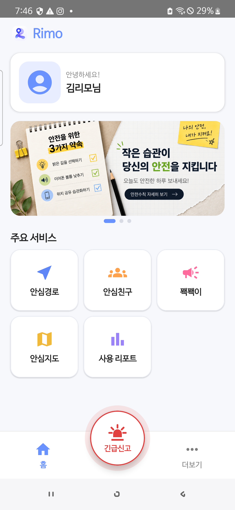
  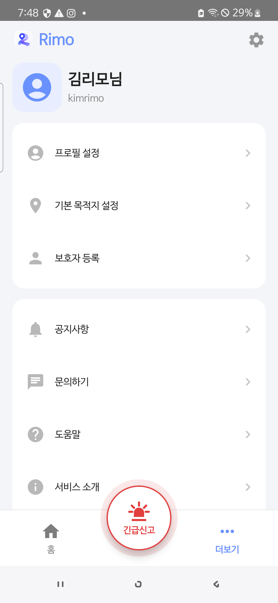
  
  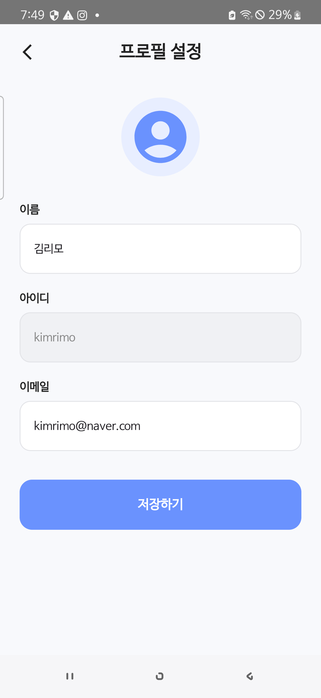
</p>

</details>

<details>
<summary><b>기본 목적지 설정 화면 보기</b></summary>

<br>

<p align="center">
  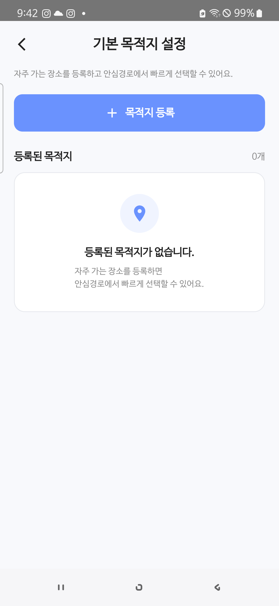
  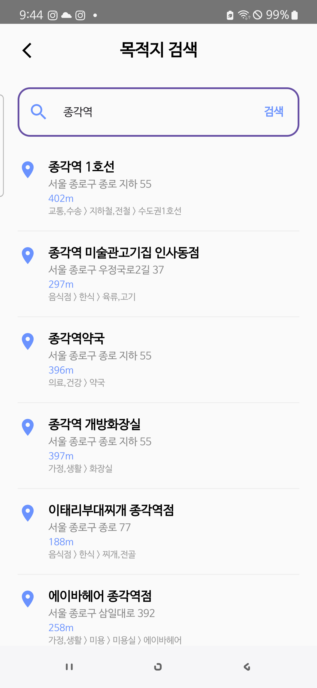
  
</p>

</details>

<br>

---

# 🏗 System Architecture


RIMO는 AWS와 Kubernetes를 기반으로  
서비스 안정성과 확장성을 고려한 Cloud Native 환경으로 구성했습니다.

```text
Android / iOS
      ↓
Amazon Route 53
      ↓
AWS WAF
      ↓
Application Load Balancer
      ↓
Kubernetes Ingress / Service
      ↓
Amazon EKS Cluster
      ↓
Backend Microservices
      ↓
ElastiCache Redis / MariaDB
```

외부 서비스와 연동하여 지도, 경로 탐색, 안전시설 데이터,  
SMS 전송 및 생성형 AI 기반 경로 설명 기능을 제공합니다.

<br>

---

# ⚙️ Microservices

Backend는 기능에 따라 5개의 API 서비스로 분리했습니다.

| Service | Description |
|---|---|
| `auth-api` | 인증 / 회원가입 |
| `member-api` | 회원 프로필 / 안심친구 |
| `tracking-api` | 실시간 위치 / 이상 상황 감지 |
| `route-api` | 안전경로 / AI 추천 |
| `data-api` | 공공데이터 / 사용 리포트 |

서비스를 기능 단위로 분리하여  
특정 API의 문제가 전체 서비스로 확산되는 것을 줄이고  
각 서비스의 독립적인 배포와 확장이 가능하도록 구성했습니다.

<br>

---

# ☁️ Cloud Infrastructure

### AWS Network & Security

- Amazon VPC
- Public / Private Subnet
- Internet Gateway
- NAT Gateway
- Route 53
- AWS WAF
- Application Load Balancer
- IAM

### Compute & Container

- Amazon EC2
- Amazon EKS
- Amazon ECR
- Docker
- Kubernetes
- Kubernetes Ingress

### Data & Storage

- Amazon ElastiCache Redis
- Amazon S3
- MariaDB

### Monitoring

- Prometheus
- Grafana
- CloudWatch

<br>

---

# 🛡 High Availability

EKS Worker Node를 서로 다른 Availability Zone에 배치하고  
동일 API Pod의 Replica를 분산했습니다.

```text
Availability Zone A
 └─ Worker Node 1
      └─ API Pods

Availability Zone B
 └─ Worker Node 2
      └─ API Pods
```

한 Worker Node에서 장애가 발생하더라도  
다른 Node의 Pod가 요청을 계속 처리할 수 있도록 구성했습니다.

<br>

---

# 📈 Auto Scaling

Kubernetes HPA를 적용하여  
서비스 부하에 따라 Pod 수가 자동으로 확장되도록 구성했습니다.

### 구성

- Metrics Server
- Horizontal Pod Autoscaler
- CPU 기반 Scaling
- Replica 자동 확장

부하 테스트에서는 실제로

```text
2 Pods → 8 Pods
```

까지 Pod가 자동 확장되는 것을 확인했습니다.

<br>

---

# 🚀 CI/CD

GitHub `main` 브랜치 변경 사항을 Jenkins가 감지하여  
5개의 Backend Service를 Amazon EKS에 자동 배포하도록 구성했습니다.

```text
GitHub
   ↓
Jenkins
   ↓
Docker Build
   ↓
Amazon ECR
   ↓
Amazon EKS
   ↓
Rolling Update
```

### Deployment Flow

1. GitHub `main` Branch 변경
2. Jenkins Pipeline 실행
3. Backend 5개 서비스 Docker Image Build
4. Amazon ECR Push
5. EKS Deployment Image 변경
6. Kubernetes Rolling Update
7. Rollout 상태 확인

<br>

---

# 🧱 Infrastructure as Code

Terraform을 이용하여 주요 AWS 인프라를 코드로 관리했습니다.

### 주요 관리 대상

- VPC
- Subnet
- Internet Gateway
- NAT Gateway
- Route Table
- EKS
- ALB
- Monitoring EC2
- IAM
- Security Group
- ElastiCache

```bash
terraform init
terraform plan
terraform apply
```

`plan`을 통해 변경 대상을 사전에 확인하고  
`apply`를 통해 동일한 인프라 구성을 반복적으로 적용할 수 있도록 구성했습니다.

<br>

---

# 📊 Monitoring & Observability

Prometheus와 Grafana를 이용하여  
서비스와 인프라 상태를 실시간으로 관측할 수 있는 환경을 구축했습니다.

### Backend Monitoring

- CPU
- Memory
- Pod 수
- 응답 시간
- 외부 API 호출

### Redis Monitoring

- Cache Hit Rate
- Memory Usage
- Connected Clients
- Command Throughput

### AWS Infrastructure Monitoring

CloudWatch를 연동하여 다음 상태를 확인합니다.

- ALB
- NAT Gateway
- WAF
- EKS Node

### Developer Monitoring

- Jenkins Build 상태
- Error Log
- 서비스 로그
- Loki / Promtail

<br>

---

# 🔔 Alerting

Grafana Alerting과 Slack을 연동하여  
서비스 이상 상황 발생 시 빠르게 확인할 수 있도록 구성했습니다.

```text
CPU 임계값 초과
      ↓
Grafana Alert 발생
      ↓
Dashboard 상태 변경
      ↓
Slack #rimo-alerts 알림
```

<br>

---

# 🧪 Load Test & Performance Improvement

nGrinder를 이용하여 실제 API에 부하를 발생시키고  
Kubernetes Auto Scaling과 외부 API 병목을 검증했습니다.

## Kakao API Bottleneck

### Problem

동일한 경로 요청이 반복되면서  
Kakao API 호출량이 증가하고 요청 실패가 발생했습니다.

### Solution

Redis Cache를 적용하여  
같은 경로 요청은 기존 결과를 재사용하도록 개선했습니다.

### Result

```text
Error Rate
69% → 0%

TPS
9.5 → 31.4
```

**처리량 약 3.3배 증가**

<br>

## Gemini API Bottleneck

### Problem

Pod를 `2 → 8`개까지 확장해도  
응답 지연이 충분히 개선되지 않았습니다.

분석 결과 Pod 처리 성능보다  
외부 Gemini API의 응답 대기 시간이 주요 병목이었습니다.

### Solution

동일한 조건의 AI 추천 결과를 Redis에 캐싱하여  
불필요한 Gemini API 요청을 줄였습니다.

### Result

```text
TPS
30.0 → 34.0
```

Pod 확장뿐 아니라  
**외부 API 호출 구조와 캐싱 전략을 함께 고려해야 함을 확인했습니다.**

<br>

---

# 🛠 Tech Stack

### Mobile

`Kotlin` `Android` `Jetpack Compose` `Retrofit` `Coroutines` `GPS / Location API`

### Backend

`Java 17` `Spring Boot` `Spring Security` `JWT` `REST API` `Redis` `MariaDB`

### Web

`React` `Vite` `Nginx`

### Cloud

`AWS` `VPC` `EC2` `EKS` `ECR` `S3` `ElastiCache` `ALB` `Route 53` `WAF` `CloudWatch`

### DevOps

`Docker` `Kubernetes` `Jenkins` `Terraform` `GitHub` `Ingress` `HPA` `Metrics Server`

### Monitoring

`Prometheus` `Grafana` `CloudWatch` `Loki` `Promtail` `nGrinder`

### External API

`Kakao Maps API` `Kakao Mobility Directions API` `공공데이터 API` `SOLAPI` `Gemini API`

<br>

---

# 🎬 Demo

RIMO의 실제 기능과 시스템 동작을 확인할 수 있는 시연 자료입니다.

👉 [**RIMO 시연 자료 확인하기**](./07_demo)

<br>

---

# 📂 Project Documents

프로젝트 과정에서 작성한 주요 산출물입니다.

| Category | Description | Link |
|---|---|---|
| **Overview** | 프로젝트 개요 및 서비스 소개 | [바로가기](./01_overview) |
| **UI / UX Design** | 화면 설계 및 Prototype | [바로가기](./02_design) |
| **API** | Backend API 명세 | [바로가기](./03_API) |
| **Database** | ERD 및 데이터 명세 | [바로가기](./04_database) |
| **Public Data** | 공공 안전시설 데이터 | [바로가기](./05_public-data) |
| **Infrastructure** | AWS / EKS 인프라 구성 | [바로가기](./06_infrastructure) |
| **Demo** | 서비스 시연 및 부하 테스트 | [바로가기](./07_demo) |
| **Presentation** | RIMO 최종 발표자료 | [바로가기](./08_presentation) |

<br>

---

# 📁 Repository Structure

```text
rimo-project/
│
├─ README.md
│
├─ assets/
│  └─ screenshots/
│     ├─ 1. 안심경로/
│     ├─ 2. 안심친구/
│     ├─ 3. 꽥꽥이/
│     ├─ 4. 안심지도/
│     ├─ 5. 사용 리포트/
│     ├─ 로그인,회원가입/
│     └─ 홈화면,더보기/
│
├─ 01_overview/
├─ 02_design/
├─ 03_API/
├─ 04_database/
├─ 05_public-data/
├─ 06_infrastructure/
├─ 07_demo/
└─ 08_presentation/
```

<br>

---

## RIMO

> **안전시설 데이터 · 실시간 위치 공유 · 이상 상황 대응 · Cloud Native 인프라를  
> 하나의 귀가 과정으로 연결한 안전 귀가 지원 서비스**
